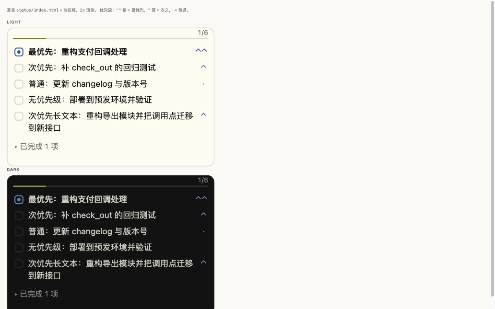

# Design notes

Reference material for the Work Status section. Not shipped to OpenChamber.



Rendered from the real `status/index.html` + `status/main.js`, driven by a stub
of the host protocol. Left: default. Middle: finished items expanded. Bottom:
dark theme.

## The problem with the first version

The section worked but looked like a terminal:

- ASCII marks (`[x]`, `[ ]`, `[•]`) instead of a checkbox, so it did not read as
  part of the app, whose own controls use a 14px/4px-border-radius box.
- A plain `Todo [7/8]` heading with no visual progress.
- Priority as right-aligned uppercase text, competing with the task text.
- Finished and open items interleaved, so a long tail of done work pushed the
  active item out of a fixed 200px section.
- Long task names reflowed at unpredictable heights.

## What it does now

| Change | Why |
| --- | --- |
| Real checkbox (13px, 4px radius, CSS-drawn tick) | Matches `.oc-sdk-check-box`; no icon font the sandboxed frame cannot load |
| 2px progress bar under the count | Progress is visible without reading numbers |
| Work in progress pinned to the top | The open item is what the reader wants first |
| Finished items collapse into `已完成 N 项` | Spends the frame on open work; expands on click, and the choice survives re-renders |
| Priority as a rising mark: `⌃⌃` / `⌃` / `·` | Visible at a glance, does not compete with the text |
| Long text wraps; row height stays predictable | |
| Frame height follows the list (24–320px) | An empty list collapses to a line instead of holding a box open |
| Past the 320px cap the list scrolls natively | Every row stays readable rather than being clipped by the rail |

## Height and scrolling

The section reports the height it needs with `host.setHeight`, and the host
clamps it to `GUEST_STATUS_SECTION_HEIGHT_MIN`/`MAX` — 24 and 320, which are the
same numbers the section uses (`eL`/`tL` in OpenChamber's own status container).

The height is **measured from the rows about to be shown**, not estimated from
`rowCount x rowHeight`. A row is only approximately the same height as the next:
the finished-group row is a control rather than a line of text, and a long task
name wraps. `frameHeight` takes the top of the last row plus its height, so the
measure includes the fold's own top margin, and the frame is elastic — it holds
every todo up to the host's 320px ceiling. `src/viewport.js` holds the bounds and
the surrounding arithmetic; `scripts/test-viewport.mjs` exercises it under Node.

The measurement has no feedback loop for the reason the old estimate was built
to avoid one: the frame is decided from the rows *before* they are laid out
against it, and the list scrolls rather than being cut to fit — a few pixels
short hides part of a row behind a scrollbar instead of dropping it. When the
height changes it is handed back to the host, which resizes the wrapper and never
reloads the frame, so the scroll position survives.

Two rules keep it from twitching:

- A change under `HEIGHT_DELTA` (8px) is not worth a round trip.
- Changes inside `HEIGHT_SETTLE_MS` (150ms) coalesce into one resize.

The first paint is exempt from both, because the frame still carries the
manifest's height (`height: 56`) and holding the gate would leave it visibly
wrong for as long as the gate holds. 56 rather than the old 200: the empty state
collapses to 24, so a 200px first frame meant a visible 176px drop on every app
launch.

### Scrolling

Past the host's 320px ceiling the body is an ordinary native scroll container:
`overflow-y: auto`, and nothing else. The wheel, the keyboard, touch and the
scrollbar all belong to the browser; the section intercepts none of them, so a
short list never takes the rail's own scrolling — there is no "is it scrollable"
branch to get wrong. `tabindex="0"` lets the container take focus so the arrow
and PageUp/PageDown keys work inside the frame once it is clicked.

`min-height: 0` on the body is load-bearing: a column flex child defaults to
`min-height: auto` and grows to its content, so without it the overflow never
triggers and nothing scrolls. `scrollbar-gutter: stable` keeps the text column
the same width whether or not the bar is present, so a bar appearing cannot
re-wrap a row and change the very height that summoned it.

Two behaviours sit on top of the native scroll:

- **Snap.** After `SNAP_QUIET_MS` (110ms) of no scrolling the list settles onto
  the nearest row start **or the bottom** — whichever is closer. The bottom is a
  candidate because snapping only to row starts left the last row, whose start
  sits above the maximum scroll, unreachable: every scroll to the end sprang back
  up to that row's top. At the bottom the last row is fully visible. Already at a
  boundary, it does nothing.
- **Idle return.** Ten seconds (`IDLE_MS`) after the reader's *own* scrolling,
  the list scrolls smoothly back to the top, where the in-progress row always
  sits (`order` pins it). Armed only by real input — wheel, touch, a scroll key,
  a drag on the bar — not by the `scroll` event: the snap and the return scroll
  the container themselves, so arming on `scroll` made the return re-fire every
  ten seconds. And a smooth scroll can settle a fraction short of zero, so "home"
  is `scrollTop <= 1`; landing home fires once and does not re-arm.

No scroll-position bookkeeping is needed across a repaint: `scrollTop` belongs
to the container, and `innerHTML` swaps the children without resetting it. That
is why the earlier `anchor`/`pageIndex`/`restoreAnchor` layer is gone.

## Priority marks

Two chevrons for the top level, one for the next, a dot for ordinary work.

| Mark | Priority | Colour |
| --- | --- | --- |
| `⌃⌃` | high | purple — `#5e409d` light, `#8b7ec8` dark |
| `⌃` | medium | blue — `#205ea6` light, `#4385be` dark |
| `·` | low | muted (host `--oc-muted`) |

Characters, not CSS-drawn shapes. A first attempt rotated a 5px box into a
chevron; its ink is about 7px tall, so stacking two either overflowed the 17px
line or fused into one blob. `U+2303` brings its own metrics and stacks cleanly
with `letter-spacing: -1px`.

The mark shares the task text's line box (`line-height` matched to the body), so
it rides the same baseline. An independent line-height pushed it to the row top.

The host palette has no purple, so the two priority colours are defined here.
`applyHostReady` sets `data-oc-theme` on the root, which selects the dark
variant; the `:root` values are the light ones and double as the pre-theme
fallback. Both are Flexoki, the palette the app uses.


## Colours

Everything comes from the host's `--oc-*` variables, applied by `applyHostReady`.
The names used are the ones the SDK actually defines — `--oc-fg`, `--oc-muted`,
`--oc-border`, `--oc-primary`, `--oc-success`, `--oc-warning`, `--oc-error`,
`--oc-hover`, `--oc-font`.

An earlier revision used `--oc-text`, which does not exist; the colour then fell
back to a hardcoded light-theme grey and went nearly invisible in dark mode.
Inline fallbacks in `status/index.html` now mirror the light theme so the first
paint is readable before the theme lands.

## Files here

- `preview.html` — three candidate layouts side by side, light and dark. The
  chosen one is **A · Checklist**.
- `verify.html` — renders the real shipped page against a protocol stub, so a
  change to `status/` or `src/` can be checked without installing it. Four
  panes: a 15-item list (over the 320px cap, scrolls), a 3-item list (fits, with
  the fold), an empty list (collapsed), and a 2× pane for judging the priority
  marks. Two buttons drive it: 跑滚动自检 asserts the nine scroll-model checks,
  and 回位自检（约 32 秒） asserts that the idle return fires exactly once and
  never re-arms.
- `preview.jpg` — the screenshot above.

## Checking a change

```bash
bun run build
python3 -m http.server 8899    # from the repo root
# open http://127.0.0.1:8899/design/verify.html
```

`verify.html` speaks the same wire protocol the app does: channel
`openchamber.sdk`, `v: 1`, `type: "ready"` pushed to the frame, `type:
"file-read"` answered with `{ content }`.

Three details of the harness are load-bearing:

- **`resize` is answered, and applied to the wrapper.** OpenChamber maps the
  guest's resize message onto its status container's height
  (`PluginPane` -> `onResize` -> `<div style={{height}}>`), so the frame keeps
  its document and its page state. The harness does the same instead of
  reloading the iframe, which is what makes "a scroll survives a height change"
  checkable at all.
- **The plugin-placement call is answered as already-current**, otherwise the
  section shows its one-time install notice instead of the list. The version
  marker is read from `opencode-plugin/package.json` — the same file the build
  inlines — so this does not go stale on a version bump.
- **The elastic panes are not zoomed.** `zoom: 2` on a wrapper scales the
  frame's own coordinate space, doubling every length the page measures
  inside it: a 3-row list asked for 167px instead of 91px, and the height
  arithmetic then worked on fiction. Only the static 2× pane is zoomed, for
  judging the marks and colours.

Two limits of the harness are worth stating, because a self-check brushes
against both:

- **A synthetic `wheel` event does not scroll in Chromium.** Dispatching one
  produces the event but no scrolling, so the *feel* of the wheel and the
  keyboard is a manual check. The self-checks set `scrollTop` for real and use a
  synthetic `scroll` to deliver the event a hidden frame withholds; the idle
  checks fire a synthetic `wheel` to arm the return — which is exactly the
  manual signal the section listens for — and never rely on the event scrolling.
- **A background tab throttles smooth animation.** The return checks report SKIP
  when the page is not frontmost and the position never moved, rather than
  failing on a browser behaviour the real panel does not hit. The "fires once,
  never re-arms" assertions do not depend on the animation and always run.

